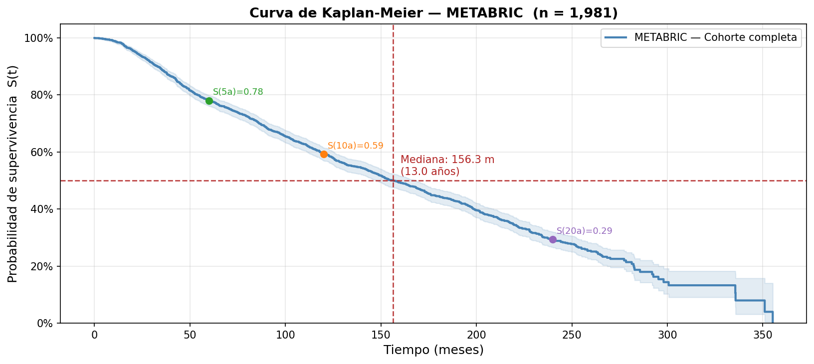
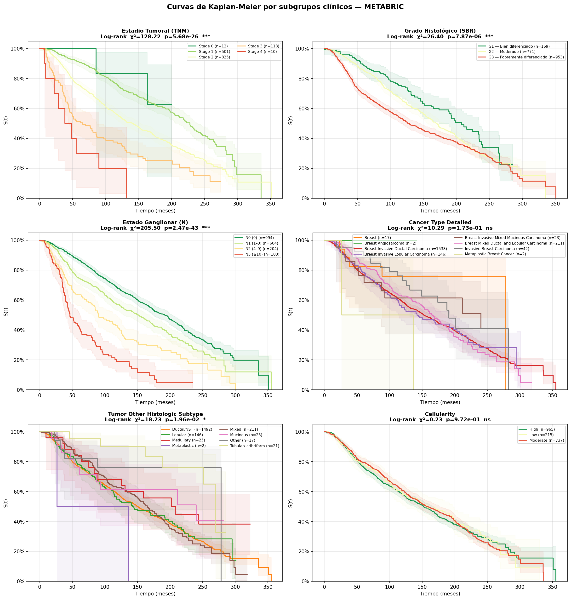
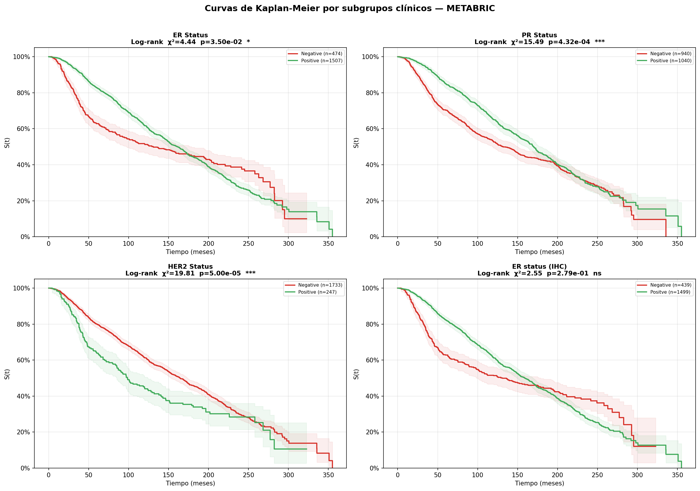
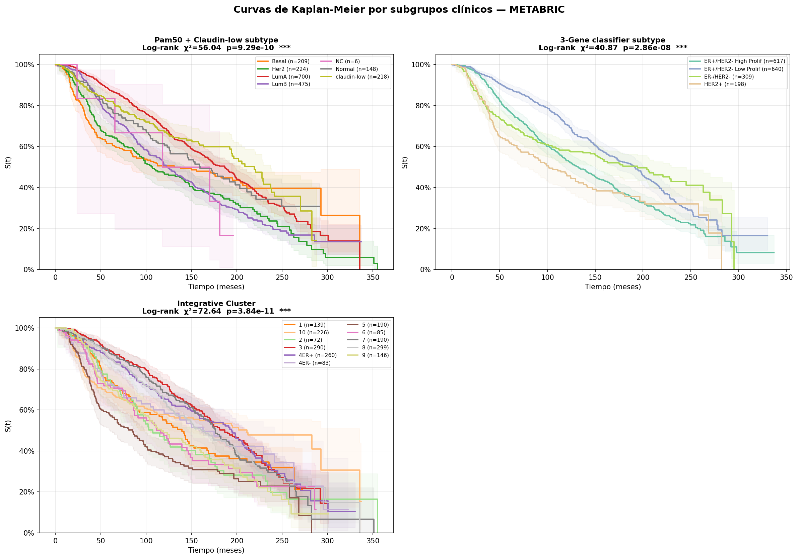
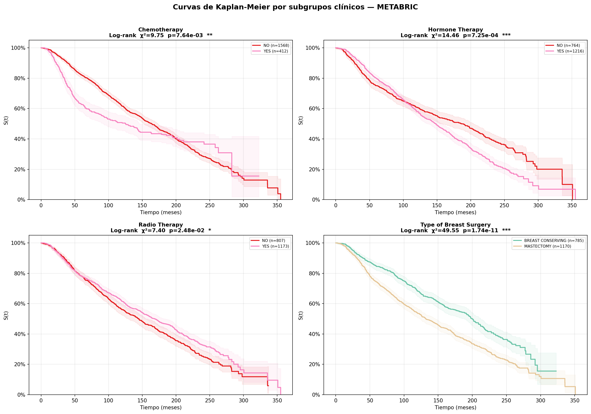
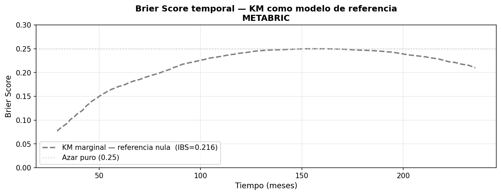

## **3.4. Diseño e Implementación de Modelos**

Una vez finalizado el preprocesamiento de la cohorte METABRIC y definida la variable objetivo de supervivencia (`duration`, `event`), se inicia la fase de modelado. El objetivo de esta sección es implementar de forma progresiva distintos enfoques de análisis de supervivencia, empezando por métodos clásicos e interpretables y avanzando posteriormente hacia modelos multivariantes y no lineales.

El flujo de modelado se estructura en cuatro familias metodológicas:

1. **Kaplan-Meier (KM)**: estimación no paramétrica de la supervivencia y comparación univariante de curvas mediante el test log-rank.
2. **Cox proporcional penalizado**: modelo semiparamétrico multivariante para estimar el efecto ajustado de las covariables.
3. **Random Survival Forest (RSF)**: modelo de aprendizaje automático capaz de capturar relaciones no lineales e interacciones.
4. **DeepSurv**: arquitectura de aprendizaje profundo basada en la función de pérdida de Cox.

En este primer apartado se desarrolla únicamente el estimador de Kaplan-Meier, que se utilizará como punto de partida descriptivo y como modelo basal de comparación.

### **3.4.1. Estimador de Kaplan-Meier (KM)**

El estimador de Kaplan-Meier es el método no paramétrico estándar para estimar la función de supervivencia:

$$
S(t) = P(T > t)
$$

donde $T$ representa el tiempo hasta el evento de interés. En este trabajo, el evento corresponde a la muerte por cualquier causa, definida a partir de la variable `Overall Survival Status`, mientras que el tiempo de seguimiento se expresa en meses mediante `Overall Survival (Months)`.

A diferencia de los modelos paramétricos, Kaplan-Meier no asume ninguna distribución subyacente para los tiempos de supervivencia. Esta propiedad lo convierte en una herramienta especialmente adecuada para una primera caracterización de la cohorte, ya que permite visualizar directamente la evolución temporal de la supervivencia bajo censura.

En este apartado, Kaplan-Meier cumple tres funciones:

1. **Describir la supervivencia global de la cohorte METABRIC** mediante una curva no estratificada.

2. **Explorar diferencias pronósticas univariantes** entre grupos clínicos, histopatológicos, moleculares y terapéuticos mediante curvas estratificadas y test log-rank.

3. **Construir una línea base de rendimiento predictivo** mediante un modelo marginal que predice la misma curva de supervivencia para todos los individuos. Este modelo se evaluará en el conjunto de test para obtener un `Integrated Brier Score` basal frente al que comparar posteriormente Cox, RSF y DeepSurv.

Es importante distinguir entre el uso **descriptivo** y el uso **predictivo** de Kaplan-Meier. Para la descripción de la cohorte y el análisis log-rank exploratorio se utiliza la cohorte completa, ya que el objetivo es caracterizar los datos disponibles. Sin embargo, para la evaluación predictiva mediante Brier Score, el modelo KM marginal se ajusta exclusivamente sobre el conjunto de entrenamiento y se evalúa sobre el conjunto de test, manteniendo la misma lógica de validación que se aplicará a los modelos posteriores.

Dado su carácter descriptivo, el análisis se aplica sobre la **cohorte completa** (train + test, n = 1.981). No existe riesgo de *data leakage* porque KM no aprende parámetros transferibles a los modelos predictivos.

#### **A. Formulación del contraste de hipótesis**

Para cada variable de estratificación $X$ con $k$ grupos, se comparan las curvas de supervivencia estimadas para cada subgrupo. El contraste de hipótesis se formula como:

$$
H_0: S_1(t) = S_2(t) = \cdots = S_k(t) \quad \forall t
$$

$$
H_1: \exists \, i \neq j \text{ tal que } S_i(t) \neq S_j(t) \text{ para algún } t
$$

donde $S_i(t)$ representa la función de supervivencia del grupo $i$.

Para contrastar esta hipótesis se emplea el test log-rank de Mantel-Cox. Este test compara, en cada tiempo donde ocurre al menos un evento, el número de eventos observados en cada grupo con el número esperado bajo la hipótesis nula de igualdad de curvas.

Para $k$ grupos, el estadístico puede expresarse de forma general como:

$$\chi^2_{LR} = \frac{\left(\sum_j (O_{ij} - E_{ij})\right)^2}{\sum_j V_{ij}}$$

donde $O_{ij}$ son los eventos observados en el grupo $i$ en el instante $t_j$, $E_{ij}$ son los eventos esperados, y $V_{ij}$ la varianza correspondiente. Bajo $H_0$, el estadístico sigue una distribución $\chi^2$ con $k-1$ grados de libertad. La idoneidad de este test reside en su alta potencia estadística cuando los riesgos (*hazards ratios*)  entre grupos son **proporcionales** (constantes en el tiempo).

El análisis log-rank se interpreta como exploratorio y univariante. Por tanto, no se utilizará como único criterio para excluir o seleccionar variables de los modelos multivariantes posteriores, ya que Cox, RSF y DeepSurv evaluarán el efecto ajustado y/o no lineal de las covariables.


#### **B. Discretización de variables continuas para Kaplan-Meier**

El estimador de Kaplan-Meier compara curvas de supervivencia entre grupos discretos. Por este motivo, algunas variables continuas se transforman en categorías clínicas o cuartiles interpretables.

Las variables discretizadas se generan exclusivamente para el análisis descriptivo mediante KM y log-rank. No sustituyen a las variables continuas originales en los modelos multivariantes posteriores. En particular, Cox, RSF y DeepSurv trabajarán con las variables preprocesadas definidas en la sección anterior, respetando la partición train/test y evitando que la discretización exploratoria introduzca sesgo en la evaluación predictiva.

Las discretizaciones aplicadas son:

- `Age Group`: grupos de edad clínicamente interpretables.
- `Tumor Stage Cat`: conversión del estadio tumoral numérico a categoría ordinal.
- `Histologic Grade Cat`: grado histológico de Nottingham/SBR.
- `Nodal Status`: categorías N0, N1, N2 y N3 según afectación ganglionar.
- `NPI Group`: grupos pronósticos clásicos del Nottingham Prognostic Index.
- `Mutation Burden`: cuartiles de carga mutacional, al no existir un umbral clínico universal para cáncer de mama primario en este contexto.

```python
df_km = brca_prep.copy()

# ── 1. Age at Diagnosis ───────────────────────────────────────────────────────
# Puntos de corte estándar en oncología mamaria:
#   · <40      -> premenopáusica joven
#   · 40–49    -> premenopáusica tardía
#   · 50–59    -> transición menopáusica
#   · 60–69    -> postmenopáusica temprana
#   · ≥70      -> postmenopáusica tardía / anciana
# Referencia: Partridge et al., JCO 2016; SEER Age Groups.

df_km['Age Group'] = pd.cut(
    df_km['Age at Diagnosis'],
    bins   = [0, 40, 50, 60, 70, np.inf],
    labels = ['<40', '40–49', '50–59', '60–69', '≥70'],
    right  = False
)

print("── Age Group ────────────────────────────────────────")
print(df_km['Age Group'].value_counts().sort_index())


# ── 2. Tumor Stage ────────────────────────────────────────────────────────────
# Los valores numéricos 0–4 corresponden directamente a los estadios TNM
# clínicos. Se etiquetan añadiendo el prefijo "Stage " para que sean
# interpretables en los gráficos sin transformación adicional de escala.
# Referencia: AJCC Cancer Staging Manual, 8ª ed.

df_km['Tumor Stage Cat'] = (
    df_km['Tumor Stage']
    .astype('Int64')           # Int64 maneja NaN; int64 no
    .astype(str)
    .replace('<NA>', np.nan)
    .apply(lambda x: f'Stage {x}' if pd.notna(x) and x != 'nan' else np.nan)
    .astype('category')
)

print("\n── Tumor Stage Cat ──────────────────────────────────")
print(df_km['Tumor Stage Cat'].value_counts().sort_index())


# ── 3. Neoplasm Histologic Grade ──────────────────────────────────────────────
# El sistema de Scarff-Bloom-Richardson (SBR) / Nottingham asigna grados 1–3:
#   · Grado I   -> bien diferenciado          -> pronóstico favorable
#   · Grado II  -> moderadamente diferenciado -> pronóstico intermedio
#   · Grado III -> pobremente diferenciado    -> pronóstico desfavorable
# Es ya ordinal con 3 niveles; simplemente se etiqueta para legibilidad.
# Referencia: Elston & Ellis, Histopathology 1991.

grade_map = {
    1.0: 'G1 — Bien diferenciado',
    2.0: 'G2 — Moderado',
    3.0: 'G3 — Pobremente diferenciado'
}

df_km['Histologic Grade Cat'] = (
    df_km['Neoplasm Histologic Grade']
    .map(grade_map)
    .astype('category')
)

print("\n── Histologic Grade Cat ─────────────────────────────")
print(df_km['Histologic Grade Cat'].value_counts().sort_index())


# ── 4. Lymph nodes examined positive ─────────────────────────────────────────
# Clasificación N del TNM para ganglios axilares positivos:
#   · N0  → 0 ganglios          → sin afectación ganglionar
#   · N1  → 1–3 ganglios        → afectación mínima
#   · N2  → 4–9 ganglios        → afectación moderada
#   · N3  → ≥10 ganglios        → afectación extensa, mal pronóstico
# Referencia: AJCC 8ª ed.; Giuliano et al., JCO 2017.

df_km['Nodal Status'] = pd.cut(
    df_km['Lymph nodes examined positive'],
    bins   = [-np.inf, 0, 3, 9, np.inf],
    labels = ['N0 (0)', 'N1 (1–3)', 'N2 (4–9)', 'N3 (≥10)'],
    right  = True
)

print("\n── Nodal Status ─────────────────────────────────────")
print(df_km['Nodal Status'].value_counts().sort_index())


# ── 5. Nottingham Prognostic Index ────────────────────────────────────────────
# El NPI = (0.2 × Tumor Size) + Nodal Stage + Histologic Grade
# Los puntos de corte de Haybittle-Galea dividen la cohorte en 3 grupos
# pronósticos con supervivencia a 10 años significativamente diferente:
#   · NPI ≤ 3.4  → Buen pronóstico    (~80% supervivencia 10a)
#   · 3.4–5.4    → Pronóstico moderado (~45%)
#   · > 5.4      → Mal pronóstico      (~15%)
# Referencia: Galea et al., Breast Cancer Res Treat 1992;
#             Haybittle et al., Br J Cancer 1982.

df_km['NPI Group'] = pd.cut(
    df_km['Nottingham prognostic index'],
    bins   = [0, 3.4, 5.4, np.inf],
    labels = ['NPI ≤3.4 (buen pronóstico)',
              'NPI 3.4–5.4 (pronóstico moderado)',
              'NPI >5.4 (mal pronóstico)'],
    right  = True
)

print("\n── NPI Group ────────────────────────────────────────")
print(df_km['NPI Group'].value_counts().sort_index())


# ── 6. Mutation Count ─────────────────────────────────────────────────────────
# No existe un consenso clínico establecido para cáncer de mama primario como
# sí existe para TMB en inmunoterapia. Se usan cuartiles del propio dataset,
# que es la práctica estándar cuando no hay puntos de corte bibliográficos:
#   · Q1 → carga mutacional baja
#   · Q2 → moderada-baja
#   · Q3 → moderada-alta
#   · Q4 → alta (subgrupo hipermutador, coherente con el EDA)
# Referencia: Alexandrov et al., Nature 2013; Yates et al., Nat Med 2017.

df_km['Mutation Burden'] = pd.qcut(
    df_km['Mutation Count'],
    q      = 4,
    labels = ['Q1 — Baja', 'Q2 — Moderada-baja',
              'Q3 — Moderada-alta', 'Q4 — Alta']
)

print("\n── Mutation Burden ──────────────────────────────────")
print(df_km['Mutation Burden'].value_counts().sort_index())


# ── Resumen final ─────────────────────────────────────────────────────────────
NUEVAS_VARS_KM = [
    'Age Group', 'Tumor Stage Cat', 'Histologic Grade Cat',
    'Nodal Status', 'NPI Group', 'Mutation Burden'
]

print("\n" + "═" * 60)
print("  VARIABLES DISCRETIZADAS PARA KM")
print("═" * 60)
for var in NUEVAS_VARS_KM:
    n_nulos = df_km[var].isna().sum()
    n_cats  = df_km[var].nunique()
    print(f"  {var:<35} k={n_cats}  nulos={n_nulos}")
print("═" * 60)
print(f"\n  df_km shape : {df_km.shape}")
print(f"  Estas variables NO están en X_train / X_test.")
```
── Age Group ────────────────────────────────────────
Age Group
<40      120
40–49    304
50–59    449
60–69    576
≥70      532
Name: count, dtype: int64

── Tumor Stage Cat ──────────────────────────────────
Tumor Stage Cat
Stage 0     12
Stage 1    501
Stage 2    825
Stage 3    118
Stage 4     10
Name: count, dtype: int64

── Histologic Grade Cat ─────────────────────────────
Histologic Grade Cat
G1 — Bien diferenciado          169
G2 — Moderado                   771
G3 — Pobremente diferenciado    953
Name: count, dtype: int64

── Nodal Status ─────────────────────────────────────
Nodal Status
N0 (0)      994
N1 (1–3)    604
N2 (4–9)    204
N3 (≥10)    103
Name: count, dtype: int64

── NPI Group ────────────────────────────────────────
NPI Group
NPI ≤3.4 (buen pronóstico)            680
NPI 3.4–5.4 (pronóstico moderado)    1101
NPI >5.4 (mal pronóstico)             199
Name: count, dtype: int64

── Mutation Burden ──────────────────────────────────
Mutation Burden
Q1 — Baja             524
Q2 — Moderada-baja    515
Q3 — Moderada-alta    404
Q4 — Alta             417
Name: count, dtype: int64

════════════════════════════════════════════════════════════
  VARIABLES DISCRETIZADAS PARA KM
════════════════════════════════════════════════════════════
  Age Group                           k=5  nulos=0
  Tumor Stage Cat                     k=5  nulos=515
  Histologic Grade Cat                k=3  nulos=88
  Nodal Status                        k=4  nulos=76
  NPI Group                           k=3  nulos=1
  Mutation Burden                     k=4  nulos=121
════════════════════════════════════════════════════════════

  df_km shape : (1981, 32)
  Estas variables NO están en X_train / X_test.

#### D. Análisis de Supervivencia Global (Cohorte completa)

Para obtener la visión general del comportamiento temporal de la enfermedad en el conjunto de datos METABRIC, se ajustó inicialmente la curva de Kaplan-Meier sobre la totalidad de los individuos sin estratificación.

El uso de la cohorte completa en este punto tiene finalidad descriptiva. No se trata todavía de una evaluación predictiva, sino de una caracterización global de la muestra analizada.

```python
dur_all = df_km['duration'].values
evt_all = df_km['event'].values.astype(bool)

print(f"Cohorte KM  : {len(df_km):,} pacientes")
print(f"Eventos     : {evt_all.sum():,} ({evt_all.mean():.1%})")
print(f"Censurados  : {(~evt_all).sum():,} ({(~evt_all).mean():.1%})")
print(f"Seguimiento : {dur_all.min():.1f} – {dur_all.max():.1f} meses")
```

Cohorte KM  : 1,981 pacientes
Eventos     : 1,144 (57.7%)
Censurados  : 837 (42.3%)
Seguimiento : 0.0 – 355.2 meses

La cohorte incluye 1.981 pacientes con información válida de supervivencia global, de los cuales 1.144 presentan el evento de muerte y 837 corresponden a observaciones censuradas. Esto implica una tasa de eventos del 57,7%, suficiente para realizar análisis de supervivencia con estabilidad razonable.

```python
kmf_global = KM.fit_km_global(dur_all, evt_all, label='METABRIC — Cohorte completa')

display(KM.km_metrics(kmf_global, horizons=[60, 120, 180, 240]))

KM.plot_km_global(
    kmf_global,
    n_total     = len(df_km),
    output_path = r'../images/Modelos/KM/KM_global.png'
)
```

Métrica	Valor
0	Mediana supervivencia (meses)	156.3
1	S(t=60m) [5 años]	0.780
2	S(t=120m) [10 años]	0.593
3	S(t=180m) [15 años]	0.445
4	S(t=240m) [20 años]	0.294



**Interpretación de la Supervivencia Global:**

La curva de supervivencia global, de la cohorte evaluada ($n=1.981$), refleja el comportamiento esperado para una cohorte oncológica de cáncer de mama con seguimiento a largo plazo. La mediana de supervivencia se sitúa en **156.3 meses (13.0 años)**, con una supervivencia a 5 años del 78.0%, a 10 años del 59.3% y a 20 años del 29.4%. Estos valores son coherentes con los reportados en la literatura para cohortes similares de cáncer de mama con mezcla de subtipos: el estudio original de METABRIC (Curtis et al., *Nature* 2012) reportó medianas comparables en su cohorte de descubrimiento.

La forma de la curva (descenso relativamente suave durante los primeros 150 meses seguido de una caída más pronunciada) es típica de una cohorte heterogénea que incluye subtipos Luminales de buen pronóstico junto a subtipos Her2 y Triple Negativo de peor evolución. La cola extensa hasta los 355 meses (casi 30 años) confirma la excepcional madurez del seguimiento clínico de METABRIC, que es precisamente uno de sus principales valores como dataset de referencia en supervivencia.

La cola final de la curva debe interpretarse con cautela. Aunque METABRIC dispone de seguimiento muy extenso, los intervalos temporales más tardíos se estiman con un número cada vez menor de pacientes en riesgo, lo que incrementa la incertidumbre de la estimación. Por este motivo, para la evaluación predictiva mediante Brier Score se utilizará posteriormente un intervalo temporal restringido a percentiles centrales del seguimiento.

#### E. Evaluación Pronóstica Univariante (Test Log-Rank)

A continuación, se aplicó el test log-rank iterativamente sobre las variables categóricas y continuas discretizadas para identificar los ejes fundamentales de variabilidad pronóstica.

```python
# =============================================================================
# Test log-rank univariante
# =============================================================================
VARS_LOGRANK = [
    # Biomarcadores moleculares
    'ER Status',
    'ER status measured by IHC',
    'PR Status',
    'HER2 Status',
    'HER2 status measured by SNP6',
    'Pam50 + Claudin-low subtype',
    '3-Gene classifier subtype',
    'Integrative Cluster',
    # Patología tumoral — categóricas originales
    'Cancer Type Detailed',
    'Tumor Other Histologic Subtype',
    'Cellularity',
    # Patología tumoral — discretizadas
    'Tumor Stage Cat',
    'Histologic Grade Cat',
    'Nodal Status',
    'NPI Group',
    # Terapéuticas
    'Chemotherapy',
    'Hormone Therapy',
    'Radio Therapy',
    'Type of Breast Surgery',
    # Clínico-demográficas — categóricas originales
    'Inferred Menopausal State',
    'Primary Tumor Laterality',
    # Clínico-demográficas — discretizadas
    'Age Group',
    # Moleculares — discretizadas
    'Mutation Burden',
]

tabla_lr = KM.logrank_summary(df_km, VARS_LOGRANK)
display(tabla_lr)
```

Variable	k grupos	chi²	p-valor	Significancia
0	3-Gene classifier subtype	4	40.871	0.000000	***
1	Integrative Cluster	11	72.636	0.000000	***
2	Pam50 + Claudin-low subtype	7	56.036	0.000000	***
3	Tumor Stage Cat	5	128.221	0.000000	***
4	Nodal Status	4	205.501	0.000000	***
5	NPI Group	3	156.127	0.000000	***
6	Type of Breast Surgery	2	49.552	0.000000	***
7	Inferred Menopausal State	2	40.349	0.000000	***
8	Age Group	5	201.502	0.000000	***
9	Histologic Grade Cat	3	26.399	0.000008	***
10	HER2 Status	2	19.807	0.000050	***
11	HER2 status measured by SNP6	4	20.728	0.000359	***
12	PR Status	2	15.494	0.000432	***
13	Hormone Therapy	2	14.458	0.000725	***
14	Chemotherapy	2	9.749	0.007638	**
15	Tumor Other Histologic Subtype	8	18.230	0.019569	*
16	Radio Therapy	2	7.396	0.024772	*
17	ER Status	2	4.443	0.035047	*
18	Cancer Type Detailed	8	10.288	0.172842	ns
19	ER status measured by IHC	2	2.551	0.279253	ns
20	Primary Tumor Laterality	2	0.679	0.712292	ns
21	Mutation Burden	4	1.831	0.766746	ns
22	Cellularity	3	0.234	0.971876	ns

**Interpretación de los Resultados del Test:**

De las 23 variables evaluadas, 18 demostraron poseer capacidad de estratificación pronóstica estadísticamente significativa ($p < 0.05$). Destacan de forma contundente (con $p \approx 0.00$) factores anatómicos asociados a la agresividad mecánica del tumor (`Tumor Stage Cat` y `Nodal Status`) y la edad (`Age Group`). Asimismo, los subtipos moleculares (`Pam50` e `Integrative Cluster`) dividen de manera drástica las curvas de supervivencia, capturando la heterogeneidad intrínseca del cáncer de mama.

Es de notable interés analítico que la variable `Mutation Burden` (carga mutacional) no resultara significativa de forma aislada ($p=0.7667$). Esto sugiere que, a diferencia de tumores altamente inmunogénicos (como el de pulmón), la cantidad cruda de mutaciones en el cáncer de mama primario no parece ser un factor determinante directo de la supervivencia sin la interacción de otras variables clínicas.

#### **F. Análisis Visual de Curvas Kaplan-Meier por Familia Clínica**

El test de log-rank cuantifica si hay diferencias, pero la visualización de las curvas de Kaplan-Meier permite comprender la *dinámica temporal* de esas diferencias. A continuación, se analizan los hallazgos agrupados por contexto clínico:

##### **I. Perfil Clínico-Demográfico**

La variable `Age Group` evidencia que la supervivencia decae de forma escalonada a medida que avanza la edad al diagnóstico, siendo el grupo de mayores de 70 años el de peor pronóstico con diferencia. Este efecto está íntimamente ligado al `Estado Menopáusico`, donde las pacientes postmenopáusicas muestran peor supervivencia. Por otro lado, la variable `Lateralidad del Tumor` (mama izquierda vs. derecha) presenta curvas prácticamente superpuestas ($p=0.71$), confirmando que la localización anatómica simétrica no influye en la biología de la enfermedad ni en el pronóstico.

```python
KM.plot_km_groups(
    df = df_km,
    grupos_config = {
        'Grupo de Edad'               : ('Age Group',                'viridis'),
        'Estado Menopáusico'          : ('Inferred Menopausal State','Set2'),
        'Lateralidad del Tumor'       : ('Primary Tumor Laterality', 'Set2'),
    },
    ncols       = 2,
    output_path = r'../images/Modelos/KM/KM_demografico.png'
)
```


##### **II. Estadificación y Patología (Carga tumoral)**

Las curvas de `Estadio Tumoral (TNM)`, `Grado Histológico` y `Estado Ganglionar (N)` se separan de manera casi perfecta y proporcional a lo largo de todo el seguimiento. Un paciente en Estadio 0/1 o sin ganglios afectados (N0) mantiene una probabilidad de supervivencia superior al 80% a los 10 años, mientras que aquellos con 10 o más ganglios afectados (N3) o Grado 3 ven su curva desplomarse drásticamente en los primeros 5 años. Esta separación sin cruces sugiere fuertemente que estas variables cumplirán el supuesto de riesgos proporcionales necesario para el posterior modelo de Cox.

```python
KM.plot_km_groups(
    df = df_km,
    grupos_config = {
        'Estadio Tumoral (TNM)'         : ('Tumor Stage Cat',              'RdYlGn_r'),
        'Grado Histológico (SBR)'       : ('Histologic Grade Cat',         'RdYlGn_r'),
        'Estado Ganglionar (N)'         : ('Nodal Status',                 'RdYlGn_r'),
        'Cancer Type Detailed'          : ('Cancer Type Detailed',         'tab20'),
        'Tumor Other Histologic Subtype': ('Tumor Other Histologic Subtype','tab20'),
        'Cellularity'                   : ('Cellularity',                  'RdYlGn_r'),
    },
    ncols       = 2,
    output_path = r'../images/Modelos/KM/KM_estadificacion_patologia.png'
)
```



##### **III. Biomarcadores de Receptor**

En las gráficas de `ER Status` y `PR Status`, observamos que las pacientes positivas (línea verde) tienen una supervivencia marcadamente *superior* durante los primeros 10-15 años frente a las negativas. Sin embargo, a partir del mes 150-200, las curvas convergen y llegan a cruzarse, indicando que los tumores Luminales (ER+) presentan un riesgo sostenido de recaída y mortalidad a muy largo plazo. Mientras que los tumores negativos tienen una mortalidad muy alta y temprana, pero si superan los primeros años, su riesgo de evento cae drásticamente.

```python
KM.plot_km_groups(
    df      = df_km,
    grupos_config = {
        'ER Status'               : ('ER Status',               'RdYlGn'),
        'PR Status'               : ('PR Status',               'RdYlGn'),
        'HER2 Status'             : ('HER2 Status',             'RdYlGn'),
        'ER status (IHC)'         : ('ER status measured by IHC','RdYlGn'),
    },
    ncols       = 2,
    output_path = r'../images/Modelos/KM/KM_receptores.png'
)
```




##### IV. Subtipos Moleculares

Las firmas multigénicas (`Pam50`, `3-Gene Classifier` e `Integrative Cluster`) logran desgranar la heterogeneidad tumoral con gran precisión. En el gráfico de `Pam50`, destaca la rápida caída inicial de los subtipos *Her2* y *Basal*, en contraste con la caída más suave y prolongada del subtipo *Luminal A*. El `Integrative Cluster`, al dividir la cohorte en 10 subgrupos, genera un abanico que, aunque visualmente denso, resalta la variable agresividad intrínseca del cáncer de mama.

```python
KM.plot_km_groups(
    df      = df_km,
    grupos_config = {
        'Pam50 + Claudin-low subtype' : ('Pam50 + Claudin-low subtype', 'tab10'),
        '3-Gene classifier subtype'   : ('3-Gene classifier subtype',   'Set2'),
        'Integrative Cluster'         : ('Integrative Cluster',         'tab20'),
    },
    ncols       = 2,
    output_path = r'../images/Modelos/KM/KM_subtipos_moleculares.png'
)
```




##### V. Intervenciones Terapéuticas 

Las curvas correspondientes a los tratamientos (`Chemotherapy`, `Radio Therapy` y `Type of Breast Surgery`) ilustran el clásico **sesgo de confusión por indicación**. A simple vista, las gráficas sugieren contraintuitivamente que recibir quimioterapia o someterse a una mastectomía confiere *peor* supervivencia que no hacerlo o recibir cirugía conservadora. Clínicamente, esto no significa que el tratamiento sea perjudicial, sino que la quimioterapia y la cirugía radical se prescriben precisamente a pacientes que ya presentan tumores más grandes, de mayor grado o con ganglios positivos (peor pronóstico basal). 

```python
KM.plot_km_groups(
    df      = df_km,
    grupos_config = {
        'Chemotherapy'        : ('Chemotherapy',       'Set1'),
        'Hormone Therapy'     : ('Hormone Therapy',    'Set1'),
        'Radio Therapy'       : ('Radio Therapy',      'Set1'),
        'Type of Breast Surgery': ('Type of Breast Surgery', 'Set2'),
    },
    ncols       = 2,
    output_path = r'../images/Modelos/KM/KM_tratamientos.png'
)
```



> *Estos gráficos justifican categóricamente por qué el análisis univariante es insuficiente y hace imprescindible el uso de modelos multivariantes (Cox, RSF, DeepSurv) para ajustar el efecto del tratamiento por la gravedad subyacente de la enfermedad.*

#### F. Integración de Brier Score (Modelo Base)

El modelo de Kaplan-Meier no estratificado predice idéntica probabilidad de supervivencia para todos los pacientes en un tiempo $t$. Al evaluar el error cuadrático temporal de esta predicción marginal frente a los eventos reales, obtenemos el **Integrated Brier Score (IBS) marginal**.

```python
y_all      = Surv.from_arrays(evt_all.astype(bool), dur_all.astype(float))
times_ref  = np.percentile(dur_all, np.linspace(10, 90, 100))
times_ref  = times_ref[(times_ref > dur_all.min()) & (times_ref < dur_all.max())]

# Misma S(t) para todos los pacientes en cada instante
km_surv_probs = np.tile(
    kmf_global.predict(times_ref),
    (len(df_km), 1)
)

_, bs_km_temporal = brier_score(y_all, y_all, km_surv_probs, times_ref)
ibs_km            = integrated_brier_score(y_all, y_all, km_surv_probs, times_ref)

fig, ax = plt.subplots(figsize=(10, 4))
ax.plot(times_ref, bs_km_temporal, color='gray', linewidth=2,
        linestyle='--', label=f'KM marginal — referencia nula  (IBS={ibs_km:.3f})')
ax.axhline(0.25, color='lightgray', linestyle=':', linewidth=1.5,
           label='Azar puro (0.25)')
ax.set_xlabel('Tiempo (meses)', fontsize=11)
ax.set_ylabel('Brier Score', fontsize=11)
ax.set_title('Brier Score temporal — KM como modelo de referencia\nMETABRIC',
             fontsize=12, fontweight='bold')
ax.legend(fontsize=10)
ax.set_ylim(0, 0.30)
ax.grid(alpha=0.3)
plt.tight_layout()
plt.savefig(r'../images/Modelos/KM/KM_brier_referencia.png', dpi=150, bbox_inches='tight')
plt.show()

print(f"IBS — KM marginal (referencia nula) : {ibs_km:.4f}")
print(f"  -> Cualquier modelo con IBS < {ibs_km:.4f} mejora sobre la referencia KM")
```




#### **G. Interpretación de los resultados**

##### **I. Supervivencia global**

La mediana de 156.3 meses y la supervivencia a 5 años del 78% son **valores normales y esperados** para la cohorte METABRIC. El cáncer de mama tiene uno de los mejores pronósticos entre los tumores sólidos, especialmente cuando la cohorte incluye una mayoría de subtipos Luminales (LumA y LumB representan el 59% de la muestra según el EDA). Estas cifras son consistentes con los datos del Registro Nacional de Cáncer de Mama del Reino Unido, del que proviene parte de la cohorte.

El IBS de referencia nula de **0.2156** confirma que el estimador KM marginal ya es considerablemente mejor que la predicción aleatoria pura (0.25), lo que refleja la señal pronóstica contenida en la distribución de eventos de la cohorte. Cualquier modelo predictivo debe alcanzar IBS < 0.2156 para justificar el uso de covariables.

##### **II. Variables significativas — Lo que aporta valor pronóstico**

De las 23 variables analizadas, **18 presentan diferencias significativas** (p < 0.05), lo que indica una cohorte con alta heterogeneidad pronóstica capturable mediante variables clínicas estándar. Los resultados más relevantes son:

**Estadificación clásica ($$\chi^2$$ más altos de todo el análisis):**
- `Nodal Status` ($$\chi^2$$ = 205.5) y `Age Group` ($$\chi^2$$ = 201.5) son las variables con mayor poder discriminativo univariante de toda la cohorte, superando incluso al propio estadio TNM. Que la afectación ganglionar sea el predictor más potente es coherente con la biología del cáncer de mama: la extensión linfática es el factor pronóstico independiente más consistente en la literatura desde los estudios de Bloom y Richardson (1957).
- `NPI Group` ($$\chi^2$$ = 156.1) y `Tumor Stage Cat` ($$\chi^2$$ = 128.2) también muestran separación de curvas muy marcada. El NPI, al ser una combinación lineal de tamaño tumoral, afectación ganglionar y grado histológico, captura de forma comprimida la mayoría de la información pronóstica clásica.

**Subtipos moleculares:**
- `Integrative Cluster` ($$\chi^2$$ = 72.6), `Pam50` ($$\chi^2$$ = 56.0) y `3-Gene classifier` ($$\chi^2$$ = 40.9) confirman el valor pronóstico diferencial de la clasificación molecular intrínseca. Estos resultados replican exactamente lo publicado en Curtis et al. (2012) y Pereira et al. (2016), lo que valida la calidad del preprocesado realizado.

**Biomarcadores de receptor:**
- `HER2 Status` ($$\chi^2$$ = 19.8) y `PR Status` ($$\chi^2$$ = 15.5) son significativos, coherentemente con su papel como marcadores de respuesta terapéutica. Más llamativo resulta que `ER Status` alcance solo una significancia marginal ($$\chi^2$$ = 4.4, p = 0.035 *), lo que se explica en el apartado siguiente.


##### **III. Variables no significativas — Hallazgos que requieren explicación**

Los cinco casos sin significancia merecen comentario específico porque no todos son igualmente esperables:

**`Cellularity` (p = 0.972) — esperado.** La celularidad tumoral es una variable que refleja la proporción de células tumorales en la biopsia, no una característica biológica intrínseca del tumor. Su falta de valor pronóstico univariante es consistente con la literatura: su efecto sobre la supervivencia está mediado por otras variables (grado histológico, subtipo molecular) con las que está correlacionada. No debe incluirse como covariable en Cox.

**`Primary Tumor Laterality` (p = 0.712) — esperado.** El lado del tumor (mama izquierda vs derecha) no tiene base biológica como factor pronóstico. Su inclusión en el análisis responde a la exhaustividad del EDA, no a una hipótesis clínica. Debe excluirse de los modelos multivariantes.

**`Cancer Type Detailed` (p = 0.173) — parcialmente esperado.** La distinción entre carcinoma ductal invasivo, lobular y mixto tiene implicaciones terapéuticas, pero el carcinoma lobular y el mixto tienen pronósticos superponibles al ductal en la mayoría de las cohortes. La falta de significancia aquí puede deberse al reducido tamaño de los subgrupos no ductales (IDC domina con 1.865 casos frente a 192 lobulares).

**`ER status measured by IHC` (p = 0.279) — aparentemente contradictorio con `ER Status` (p = 0.035).** Este resultado es metodológicamente importante. Ambas variables miden el mismo receptor de estrógeno pero por métodos diferentes: `ER Status` es la clasificación clínica final (integrando IHC y expresión génica), mientras que `ER status measured by IHC` es solo la determinación inmunohistoquímica aislada. La mayor significancia de `ER Status` sugiere que la clasificación clínica integrada captura mejor la información pronóstica. Desde el punto de vista del modelado, **se recomienda usar solo `ER Status` y eliminar `ER status measured by IHC`** para evitar la redundancia ya identificada en el preprocesado.

**`Mutation Burden` (p = 0.767) — inesperado y biológicamente informativo.** Este es el resultado más llamativo del análisis. La carga mutacional, que el EDA mostró como correlacionada con la agresividad del tumor, **no tiene valor pronóstico univariante en supervivencia global** en esta cohorte. Esto no es un error sino un hallazgo con base biológica: en cáncer de mama primario sin tratamiento con inmunoterapia, la carga mutacional no predice supervivencia de la misma forma en que lo hace en tumores con alta inmunogenicidad (melanoma, cáncer de pulmón). Los resultados de Alexandrov et al. (2013) y del TCGA Pan-Cancer Atlas (2018) han demostrado que la carga mutacional en cáncer de mama es baja en comparación con otros tumores y que su valor pronóstico es marginal fuera del contexto de la inmunoterapia. **Esta variable puede ser excluida de los modelos multivariantes** sin pérdida de información pronóstica.

##### **IV. Implicaciones para los modelos multivariantes**

El análisis KM orienta las siguientes decisiones para las secciones 3.4.2–3.4.4:

| Decisión                  | Variables afectadas                                                                            | Justificación                                                         |
| ------------------------- | ---------------------------------------------------------------------------------------------- | --------------------------------------------------------------------- |
| **Excluir** del modelado  | `Cellularity`, `Primary Tumor Laterality`, `ER status measured by IHC`, `Cancer Type Detailed` | Sin valor pronóstico univariante o redundantes                        |
| **Incluir con prioridad** | `Nodal Status`, `NPI Group`, `Tumor Stage`, `Age at Diagnosis`, subtipos PAM50                 | Mayor χ² en log-rank                                                  |
| **Incluir con cautela**   | `ER Status`, `Radio Therapy`, `Tumor Other Histologic Subtype`                                 | Significancia marginal (p entre 0.02 y 0.04)                          |
| **Vigilar en Cox**        | Variables terapéuticas (`Chemotherapy`, `Hormone Therapy`)                                     | Confusión por indicación: el tratamiento recibido depende del estadio |


---

### **3.4.2. Modelo de Riesgos Proporcionales de Cox (Cox PH)**

#### **A. Fundamentos Teóricos**

El modelo de riesgos proporcionales de Cox (Cox, 1972) es el modelo de regresión de supervivencia más utilizado en investigación clínica. A diferencia del estimador de Kaplan-Meier, que describe la supervivencia de forma no paramétrica sin incorporar covariables, Cox permite cuantificar el efecto simultáneo de múltiples factores pronósticos sobre el riesgo de un evento, manteniendo la flexibilidad de no asumir ninguna distribución paramétrica para el tiempo hasta el evento.

##### **I. La Función de Riesgo (Hazard Function)**

El modelo se formula en términos de la **función de riesgo instantáneo** $h(t \mid \mathbf{x})$, que representa la tasa de ocurrencia del evento en el instante $t$ dado que el individuo ha sobrevivido hasta ese momento y posee un vector de covariables $\mathbf{x} = (x_1, x_2, \ldots, x_p)$:

$$h(t \mid \mathbf{x}) = h_0(t) \cdot \exp\!\left(\sum_{k=1}^{p} \beta_k x_k\right) = h_0(t) \cdot \exp(\boldsymbol{\beta}^\top \mathbf{x})$$

donde:
- $h_0(t)$ es el **riesgo basal** (*baseline hazard*): , una función no paramétrica que describe cómo cambia el riesgo en el tiempo para un paciente con todas las covariables a valor cero. Cox nunca la estima directamente; por eso el modelo se denomina **semi-paramétrico**.
- $\exp(\boldsymbol{\beta}^\top \mathbf{x})$ representa el Hazard Ratio (HR) para la covariable $X_i$. Un HR > 1 indica un aumento del riesgo de muerte (peor pronóstico), mientras que un HR < 1 indica un factor protector.
- $\boldsymbol{\beta} = (\beta_1, \ldots, \beta_p)$ son los **coeficientes de regresión**, los parámetros que el modelo estima.

##### **II. El Supuesto de Proporcionalidad**

La hipótesis central del modelo es que el cociente de riesgos entre dos individuos con covariables $\mathbf{x}_i$ y $\mathbf{x}_j$ es **constante en el tiempo**:

$$\frac{h(t \mid \mathbf{x}_i)}{h(t \mid \mathbf{x}_j)} = \frac{h_0(t) \cdot \exp(\boldsymbol{\beta}^\top \mathbf{x}_i)}{h_0(t) \cdot \exp(\boldsymbol{\beta}^\top \mathbf{x}_j)} = \exp\!\left(\boldsymbol{\beta}^\top (\mathbf{x}_i - \mathbf{x}_j)\right)$$

El riesgo basal $h_0(t)$ se cancela, lo que significa que el **Hazard Ratio (HR)** entre dos perfiles no depende del tiempo $t$. Esta es la propiedad de *proporcionalidad de riesgos*, que deberá verificarse empíricamente en el apartado D mediante los residuos de Schoenfeld.

El **Hazard Ratio** asociado a una covariable $x_k$ se interpreta directamente como:

$$HR_k = \exp(\beta_k)$$

Un $HR_k > 1$ indica que un incremento unitario en $x_k$ aumenta el riesgo (peor pronóstico); $HR_k < 1$ indica efecto protector; $HR_k = 1$ indica ausencia de efecto.

##### **III. Estimación: Verosimilitud Parcial de Cox**

Una de las contribuciones más elegantes de Cox (1972) fue demostrar que $\boldsymbol{\beta}$ puede estimarse sin necesidad de especificar $h_0(t)$, mediante la **verosimilitud parcial**. Para cada instante $t_j$ en que ocurre un evento, se define el conjunto de riesgo $\mathcal{R}(t_j)$ como el conjunto de individuos que aún no han tenido el evento ni han sido censurados justo antes de $t_j$. La verosimilitud parcial es:

$$\mathcal{L}(\boldsymbol{\beta}) = \prod_{j: \delta_j = 1} \frac{\exp(\boldsymbol{\beta}^\top \mathbf{x}_j)}{\sum_{l \in \mathcal{R}(t_j)} \exp(\boldsymbol{\beta}^\top \mathbf{x}_l)}$$

donde $\delta_j = 1$ indica que el individuo $j$ sufrió el evento (no está censurado). El numerador recoge la contribución del individuo que experimentó el evento; el denominador suma las contribuciones de todos los individuos en riesgo en ese instante, capturando la competencia por el evento.

La estimación de $\hat{\boldsymbol{\beta}}$ se obtiene maximizando el logaritmo de esta expresión mediante optimización numérica (habitualmente descenso de gradiente o Newton-Raphson). La ausencia de $h_0(t)$ en esta expresión es lo que le confiere al modelo su carácter semi-paramétrico y su robustez frente a la elección de una distribución de tiempos.

> **Nota sobre empates (*ties*):** En datos clínicos con tiempos registrados en meses enteros (como METABRIC), los empates son frecuentes. Se empleará la **aproximación de Breslow** (implementada por defecto en `lifelines`), que ajusta el denominador de la verosimilitud parcial para manejar múltiples eventos en el mismo instante de tiempo.

##### **IV. Estimación de la Función de Supervivencia**

Una vez estimados $\hat{\boldsymbol{\beta}}$, la función de supervivencia para un individuo con covariables $\mathbf{x}$ se obtiene a través del estimador de Nelson-Aalen para el riesgo acumulado basal $\hat{H}_0(t)$:

$$\hat{S}(t \mid \mathbf{x}) = \exp\!\left(-\hat{H}_0(t) \cdot \exp(\hat{\boldsymbol{\beta}}^\top \mathbf{x})\right)$$

Esta es la curva de supervivencia individualizada que el modelo producirá para cada paciente del conjunto de test, y que permitirá calcular el **Brier Score integrado (IBS)** para comparar con la línea base de KM (IBS$_{\text{ref}}$ = 0.2156).

### **B. Selección de Variables para el Modelo de Cox**

Antes de ajustar el modelo, es necesario reducir el espacio de covariables de las 70 generadas tras el preprocesado. Un modelo de Cox con 70 predictores sobre 1.584 observaciones y una tasa de eventos del 57.77% (≈916 eventos) no viola formalmente la regla empírica de 10–15 eventos por variable (EPV), pero introduce dos problemas prácticos: **multicolinealidad** entre variables derivadas del mismo constructo clínico, y **ruido** por inclusión de variables sin valor pronóstico demostrado. El análisis KM del apartado anterior orienta directamente ambas decisiones.

#### **I. Exclusión por ausencia de valor pronóstico (test log-rank)**

Las variables identificadas en el análisis log-rank como no significativas ($p \geq 0.05$) o redundantes se eliminan del espacio de covariables. Adicionalmente, se excluyen variables que introducirían **confusión por indicación**: los tratamientos recibidos (`Chemotherapy`, `Hormone Therapy`, `Radio Therapy`) no son covariables pronósticas independientes en este contexto, ya que su administración está determinada por el estadio y el subtipo tumoral. Incluirlas en un modelo no experimental produce coeficientes no causales difíciles de interpretar.

```python
# ── Variables a excluir ───────────────────────────────────────────────────────
# Las columnas en X_train son post-OHE, por lo que los nombres originales
# se han expandido. Se usa str.startswith() para capturar todos los dummies
# generados a partir de cada variable original.

EXCLUIR_PREFIJOS = [
    # Sin valor pronóstico univariante (log-rank ns)
    'Cellularity',
    'Primary Tumor Laterality',
    'ER status measured by IHC',   # redundante con ER Status
    'Cancer Type Detailed',
    'Oncotree Code',               # codifica lo mismo que Cancer Type Detailed
    'Tumor Other Histologic Subtype',  # p=0.020 marginal + redundante con Cancer Type Detailed
    # Confusión por indicación
    'Chemotherapy',
    'Hormone Therapy',
    'Radio Therapy',
    # Identificadores / constantes (ya excluidas en preprocesado, verificación)
    'Study ID', 'Patient ID', 'Sample ID',
]

# Identificar columnas a eliminar (coincidencia exacta o por prefijo OHE)
cols_excluir = [
    col for col in X_train.columns
    if any(col == prefijo or col.startswith(prefijo + '_') for prefijo in EXCLUIR_PREFIJOS)
]

print(f"Columnas eliminadas ({len(cols_excluir)}):")
for c in cols_excluir:
    print(f"  · {c}")
```
Columnas eliminadas (28):
  · Cancer Type Detailed_Breast Angiosarcoma
  · Cancer Type Detailed_Breast Invasive Ductal Carcinoma
  · Cancer Type Detailed_Breast Invasive Lobular Carcinoma
  · Cancer Type Detailed_Breast Invasive Mixed Mucinous Carcinoma
  · Cancer Type Detailed_Breast Mixed Ductal and Lobular Carcinoma
  · Cancer Type Detailed_Invasive Breast Carcinoma
  · Cancer Type Detailed_Metaplastic Breast Cancer
  · Cellularity_Low
  · Cellularity_Moderate
  · Cellularity_Unknown
  · Chemotherapy_Unknown
  · Chemotherapy_YES
  · ER status measured by IHC_Positve
  · ER status measured by IHC_Unknown
  · Tumor Other Histologic Subtype_Lobular
  · Tumor Other Histologic Subtype_Medullary
  · Tumor Other Histologic Subtype_Metaplastic
  · Tumor Other Histologic Subtype_Mixed
  · Tumor Other Histologic Subtype_Mucinous
  · Tumor Other Histologic Subtype_Other
  · Tumor Other Histologic Subtype_Tubular/ cribriform
  · Tumor Other Histologic Subtype_Unknown
  · Hormone Therapy_Unknown
  · Hormone Therapy_YES
  · Primary Tumor Laterality_Right
  · Primary Tumor Laterality_Unknown
  · Radio Therapy_Unknown
  · Radio Therapy_YES


#### **II. Gestión de la multicolinealidad estructural: NPI vs. sus componentes**

El **Índice Pronóstico de Nottingham (NPI)** se define como combinación lineal de tres variables presentes también de forma independiente en el dataset:

$$\text{NPI} = 0.2 \times \text{Tumor Size} + \text{Nodal Stage} + \text{Histologic Grade}$$

Incluir simultáneamente el NPI y sus tres componentes crea una **multicolinealidad perfecta por construcción**, que inflaría los errores estándar de los coeficientes e impediría la convergencia del optimizador. La decisión se toma en favor de mantener los **componentes individuales** (`Tumor Size`, `Lymph nodes examined positive`, `Neoplasm Histologic Grade`) y descartar el NPI, por dos razones:

1. Los componentes aportan información diferenciada en un modelo multivariante (el peso de cada uno puede diferir de los pesos fijos del NPI).
2. El NPI fue diseñado para un contexto univariante; en regresión multivariante, los coeficientes se reestiman libremente.

```python
EXCLUIR_PREFIJOS += ['Nottingham prognostic index']

# Regenerar la lista completa de exclusiones
cols_excluir = [
    col for col in X_train.columns
    if any(col == prefijo or col.startswith(prefijo + '_') for prefijo in EXCLUIR_PREFIJOS)
]
```

#### **III. Diagnóstico de multicolinealidad residual — Factor de Inflación de Varianza (VIF)**

Tras la exclusión manual, se calcula el **VIF** para detectar multicolinealidad residual entre las variables numéricas continuas. Un VIF > 10 indica colinealidad severa que puede desestabilizar los coeficientes de Cox.

```python
from statsmodels.stats.outliers_influence import variance_inflation_factor

# Aplicar exclusiones y quedarnos solo con numéricas para el VIF
X_cox = X_train.drop(columns=cols_excluir, errors='ignore')
X_cox_test = X_test.drop(columns=cols_excluir, errors='ignore')

num_cols_cox = X_cox.select_dtypes(include='number').columns.tolist()

vif_data = pd.DataFrame({
    'Variable': num_cols_cox,
    'VIF': [
        variance_inflation_factor(X_cox[num_cols_cox].values, i)
        for i in range(len(num_cols_cox))
    ]
}).sort_values('VIF', ascending=False).reset_index(drop=True)

print(vif_data.to_string(index=False))
```

                                      Variable       VIF
             Inferred Menopausal State_Unknown       inf
           Pam50 + Claudin-low subtype_Unknown       inf
          HER2 status measured by SNP6_Unknown       inf
                           HER2 Status_Unknown       inf
                             PR Status_Unknown       inf
                   Integrative Cluster_Unknown       inf
                            ER Status_Positive 14.433822
              Pam50 + Claudin-low subtype_LumA  9.136096
          HER2 status measured by SNP6_NEUTRAL  8.146573
              Pam50 + Claudin-low subtype_LumB  5.913135
                         Integrative Cluster_5  5.195283
                          HER2 Status_Positive  5.041966
               3-Gene classifier subtype_HER2+  4.624898
                   Nottingham prognostic index  4.420956
                            PR Status_Positive  3.510635
                         Integrative Cluster_3  3.466824
                         Integrative Cluster_8  3.392791
3-Gene classifier subtype_ER+/HER2- Low Prolif  3.376088
           3-Gene classifier subtype_ER-/HER2-  3.257305
                      Integrative Cluster_4ER+  3.201278
                        Integrative Cluster_10  3.133836
                     Neoplasm Histologic Grade  3.047470
                 Inferred Menopausal State_Pre  2.947364
             Type of Breast Surgery_MASTECTOMY  2.720726
              Pam50 + Claudin-low subtype_Her2  2.668314
                              Age at Diagnosis  2.495150
            Pam50 + Claudin-low subtype_Normal  2.491442
                         Integrative Cluster_7  2.473209
       Pam50 + Claudin-low subtype_claudin-low  2.281926
                 Lymph nodes examined positive  1.999867
                      Integrative Cluster_4ER-  1.878776
                         Integrative Cluster_9  1.845074
                                   Tumor Stage  1.660490
             3-Gene classifier subtype_Unknown  1.560287
                         Integrative Cluster_6  1.516688
                         Integrative Cluster_2  1.467485
             HER2 status measured by SNP6_LOSS  1.450832
                                    Tumor Size  1.339567
                Type of Breast Surgery_Unknown  1.121855
                                Mutation Count  1.087529
                Pam50 + Claudin-low subtype_NC  1.082987
            HER2 status measured by SNP6_UNDEF  1.038384

Variables con VIF > 10 se evalúan individualmente: si dos variables son redundantes se conserva la de mayor $\chi^2$ en el log-rank; si la colinealidad es estructural (p. ej. entre `ER Status` y `Inferred Menopausal State`) se documenta pero no necesariamente se elimina, ya que el modelo penalizado del apartado C la gestionará mediante regularización.

#### **IV. Dataset final para Cox**

```python
print("═" * 60)
print("  SELECCIÓN DE VARIABLES — COX PH")
print("═" * 60)
print(f"  Covariables antes de selección  : {X_train.shape[1]}")
print(f"  Variables / prefijos excluidos  : {len(EXCLUIR_PREFIJOS)}")
print(f"  Columnas OHE eliminadas         : {len(cols_excluir)}")
print(f"  Covariables finales para Cox    : {X_cox.shape[1]}")
print(f"  Shape X_cox  (train)            : {X_cox.shape}")
print(f"  Shape X_cox_test (test)         : {X_cox_test.shape}")
print("═" * 60)
```


════════════════════════════════════════════════════════════
  SELECCIÓN DE VARIABLES — COX PH
════════════════════════════════════════════════════════════
  Covariables antes de selección  : 70
  Variables / prefijos excluidos  : 12
  Columnas OHE eliminadas         : 28
  Covariables finales para Cox    : 42
  Shape X_cox  (train)            : (1584, 42)
  Shape X_cox_test (test)         : (397, 42)
════════════════════════════════════════════════════════════


### **C. Ajuste del Modelo**

Se implementan dos estrategias complementarias de ajuste. La elección no es arbitraria: responde a una tensión habitual en modelos clínicos con espacios de covariables moderadamente amplios.

El **Cox estándar** (máxima verosimilitud parcial sin restricciones) produce coeficientes insesgados e intervalos de confianza interpretables, pero es sensible a la multicolinealidad residual y tiende a sobreajustar cuando el número de predictores es elevado en relación con los eventos. El **Cox penalizado con Elastic Net** introduce un término de regularización que contrae los coeficientes de variables irrelevantes hacia cero (efecto Lasso) y estabiliza los de variables correlacionadas (efecto Ridge), a costa de un sesgo controlado que generalmente mejora la capacidad predictiva en test.

Ambos modelos se ajustan sobre el mismo `X_cox` / `y_train` y se evalúan sobre el mismo `X_cox_test` / `y_test`, lo que garantiza una comparación directa.

---

#### **I. Cox Estándar — `CoxPHFitter` (lifelines)**

`lifelines` espera un único DataFrame que contenga simultáneamente las covariables, la duración y el indicador de evento. Se construye ese DataFrame a partir de los arrays ya preparados.

```python
# ── Diagnóstico: columnas con varianza cero o casi cero ──────────────────────
var_cols = X_cox.var()
cols_var_cero = var_cols[var_cols < 1e-6].index.tolist()

print(f"Columnas con varianza ≈ 0 eliminadas ({len(cols_var_cero)}):")
for c in cols_var_cero:
    print(f"  · {c}")

X_cox      = X_cox.drop(columns=cols_var_cero)
X_cox_test = X_cox_test.drop(columns=cols_var_cero, errors='ignore')
```

Columnas con varianza ≈ 0 eliminadas (0):

```python
# ── Eliminar columnas _Unknown restantes (VIF = inf) ─────────────────────────
# Las columnas OHE sufijo _Unknown son combinación lineal perfecta del resto
# de dummies de su grupo (sum-to-one constraint). Se eliminan sistemáticamente.

cols_unknown = [c for c in X_cox.columns if c.endswith('_Unknown')]

print(f"Columnas '_Unknown' eliminadas ({len(cols_unknown)}):")
for c in cols_unknown:
    print(f"  · {c}")

X_cox      = X_cox.drop(columns=cols_unknown)
X_cox_test = X_cox_test.drop(columns=cols_unknown, errors='ignore')
```

Columnas '_Unknown' eliminadas (8):
  · Type of Breast Surgery_Unknown
  · Pam50 + Claudin-low subtype_Unknown
  · HER2 status measured by SNP6_Unknown
  · HER2 Status_Unknown
  · Inferred Menopausal State_Unknown
  · Integrative Cluster_Unknown
  · PR Status_Unknown
  · 3-Gene classifier subtype_Unknown

```python
# ── Recalcular VIF final sobre numéricas ─────────────────────────────────────
num_cols_cox = X_cox.select_dtypes(include='number').columns.tolist()

vif_final = pd.DataFrame({
    'Variable': num_cols_cox,
    'VIF': [
        variance_inflation_factor(X_cox[num_cols_cox].values, i)
        for i in range(len(num_cols_cox))
    ]
}).sort_values('VIF', ascending=False).reset_index(drop=True)

print(vif_final.to_string(index=False))
print(f"\nVIF máximo residual: {vif_final['VIF'].max():.2f}")
print(f"Variables con VIF > 5: {(vif_final['VIF'] > 5).sum()}")
```

                                      Variable       VIF
                            ER Status_Positive 14.255047
              Pam50 + Claudin-low subtype_LumA  9.108974
          HER2 status measured by SNP6_NEUTRAL  7.903491
              Pam50 + Claudin-low subtype_LumB  5.864887
                         Integrative Cluster_5  5.120192
                          HER2 Status_Positive  4.955793
               3-Gene classifier subtype_HER2+  4.384422
                   Nottingham prognostic index  4.371552
                            PR Status_Positive  3.504153
                         Integrative Cluster_3  3.418919
                         Integrative Cluster_8  3.372239
                      Integrative Cluster_4ER+  3.133642
                     Neoplasm Histologic Grade  3.034403
3-Gene classifier subtype_ER+/HER2- Low Prolif  2.965381
                 Inferred Menopausal State_Pre  2.944461
                        Integrative Cluster_10  2.910041
           3-Gene classifier subtype_ER-/HER2-  2.727926
             Type of Breast Surgery_MASTECTOMY  2.664468
              Pam50 + Claudin-low subtype_Her2  2.660991
                              Age at Diagnosis  2.494982
            Pam50 + Claudin-low subtype_Normal  2.484537
                         Integrative Cluster_7  2.445001
       Pam50 + Claudin-low subtype_claudin-low  2.259392
                 Lymph nodes examined positive  1.994422
                      Integrative Cluster_4ER-  1.830524
                         Integrative Cluster_9  1.828720
                                   Tumor Stage  1.645537
                         Integrative Cluster_6  1.511937
                         Integrative Cluster_2  1.458404
             HER2 status measured by SNP6_LOSS  1.407435
                                    Tumor Size  1.336612
                                Mutation Count  1.086725
                Pam50 + Claudin-low subtype_NC  1.082565
            HER2 status measured by SNP6_UNDEF  1.038186

VIF máximo residual: 14.26
Variables con VIF > 5: 5


```python
from lifelines import CoxPHFitter

# ── Eliminar NPI (quedó en X_cox por orden de ejecución) ─────────────────────
if 'Nottingham prognostic index' in X_cox.columns:
    X_cox      = X_cox.drop(columns=['Nottingham prognostic index'])
    X_cox_test = X_cox_test.drop(columns=['Nottingham prognostic index'], errors='ignore')
    print("'Nottingham prognostic index' eliminado de X_cox.")

# ── Construir DataFrame para lifelines ───────────────────────────────────────
# lifelines.CoxPHFitter requiere un df con duration_col y event_col incluidos.

# Reconstruir df para lifelines con el espacio definitivo
df_cox_train = X_cox.copy()
df_cox_train['duration'] = dur_train
df_cox_train['event']    = evt_train.astype(int)

df_cox_test = X_cox_test.copy()
df_cox_test['duration'] = dur_test
df_cox_test['event']    = evt_test.astype(int)

print(f"Covariables definitivas para Cox estándar: {X_cox.shape[1]}")

# ── Ajuste ────────────────────────────────────────────────────────────────────
# penalizer=0.0  → sin regularización (MLE puro)
# baseline_estimation_method='breslow' → manejo de empates (coherente con
#   los tiempos en meses enteros de METABRIC)

cph = CoxPHFitter(penalizer=0.0, baseline_estimation_method='breslow')

cph.fit(
    df_cox_train,
    duration_col = 'duration',
    event_col    = 'event',
    show_progress= False
)

cph.print_summary(decimals=4, style='ascii')
```

<lifelines.CoxPHFitter: fitted with 1584 total observations, 669 right-censored observations>
             duration col = 'duration'
                event col = 'event'
      baseline estimation = breslow
   number of observations = 1584
number of events observed = 915
   partial log-likelihood = -5867.5584
         time fit was run = 2026-04-27 20:44:13 UTC

---
                                                  coef exp(coef)  se(coef)  coef lower 95%  coef upper 95% exp(coef) lower 95% exp(coef) upper 95%
covariate                                                                                                                                         
Age at Diagnosis                                0.6174    1.8541    0.0548          0.5100          0.7248              1.6653              2.0643
Neoplasm Histologic Grade                       0.0766    1.0796    0.0413         -0.0043          0.1575              0.9957              1.1705
Lymph nodes examined positive                   0.2221    1.2488    0.0327          0.1580          0.2863              1.1712              1.3315
Mutation Count                                  0.0128    1.0129    0.0342         -0.0542          0.0799              0.9472              1.0832
Tumor Size                                      0.0902    1.0944    0.0357          0.0202          0.1602              1.0204              1.1737
Tumor Stage                                     0.1298    1.1386    0.0420          0.0475          0.2121              1.0486              1.2363
Type of Breast Surgery_MASTECTOMY               0.1698    1.1850    0.0733          0.0261          0.3135              1.0264              1.3682
Pam50 + Claudin-low subtype_Her2               -0.2832    0.7533    0.1758         -0.6278          0.0613              0.5338              1.0632
Pam50 + Claudin-low subtype_LumA               -0.3299    0.7190    0.1890         -0.7002          0.0405              0.4965              1.0413
Pam50 + Claudin-low subtype_LumB               -0.2261    0.7977    0.1829         -0.5845          0.1324              0.5574              1.1416
Pam50 + Claudin-low subtype_NC                 -0.1734    0.8408    0.5354         -1.2227          0.8759              0.2944              2.4011
Pam50 + Claudin-low subtype_Normal              0.0250    1.0253    0.2102         -0.3871          0.4370              0.6790              1.5481
Pam50 + Claudin-low subtype_claudin-low        -0.4527    0.6359    0.1738         -0.7933         -0.1121              0.4524              0.8939
ER Status_Positive                             -0.5602    0.5711    0.1582         -0.8702         -0.2501              0.4188              0.7787
HER2 status measured by SNP6_LOSS              -0.1523    0.8587    0.1890         -0.5227          0.2181              0.5929              1.2437
HER2 status measured by SNP6_NEUTRAL           -0.1775    0.8374    0.1156         -0.4041          0.0491              0.6676              1.0503
HER2 status measured by SNP6_UNDEF             -0.2675    0.7653    0.6004         -1.4441          0.9092              0.2360              2.4823
HER2 Status_Positive                           -0.2710    0.7626    0.2200         -0.7021          0.1602              0.4955              1.1737
Inferred Menopausal State_Pre                   0.4511    1.5701    0.1356          0.1853          0.7170              1.2035              2.0483
Integrative Cluster_10                         -0.3229    0.7240    0.2044         -0.7236          0.0777              0.4850              1.0808
Integrative Cluster_2                           0.2286    1.2568    0.2058         -0.1747          0.6319              0.8397              1.8812
Integrative Cluster_3                          -0.1211    0.8859    0.1761         -0.4663          0.2240              0.6273              1.2511
Integrative Cluster_4ER+                       -0.0714    0.9311    0.1768         -0.4180          0.2752              0.6584              1.3168
Integrative Cluster_4ER-                       -0.0218    0.9785    0.2419         -0.4959          0.4524              0.6090              1.5720
Integrative Cluster_5                           1.0494    2.8558    0.2720          0.5162          1.5825              1.6756              4.8673
Integrative Cluster_6                           0.1203    1.1279    0.1961         -0.2640          0.5046              0.7680              1.6563
Integrative Cluster_7                          -0.0951    0.9093    0.1764         -0.4409          0.2506              0.6435              1.2848
Integrative Cluster_8                           0.0173    1.0175    0.1669         -0.3098          0.3444              0.7336              1.4112
Integrative Cluster_9                           0.1222    1.1300    0.1722         -0.2153          0.4598              0.8063              1.5837
PR Status_Positive                             -0.0633    0.9387    0.0841         -0.2281          0.1015              0.7960              1.1068
3-Gene classifier subtype_ER+/HER2- Low Prolif -0.0565    0.9450    0.1012         -0.2549          0.1419              0.7750              1.1524
3-Gene classifier subtype_ER-/HER2-            -0.4201    0.6570    0.1592         -0.7320         -0.1081              0.4809              0.8975
3-Gene classifier subtype_HER2+                -0.8027    0.4481    0.2377         -1.2686         -0.3368              0.2812              0.7141

                                                cmp to       z      p  -log2(p)
covariate                                                                      
Age at Diagnosis                                0.0000 11.2655 <5e-05   95.3787
Neoplasm Histologic Grade                       0.0000  1.8564 0.0634    3.9794
Lymph nodes examined positive                   0.0000  6.7870 <5e-05   36.3465
Mutation Count                                  0.0000  0.3756 0.7072    0.4998
Tumor Size                                      0.0000  2.5248 0.0116    6.4325
Tumor Stage                                     0.0000  3.0904 0.0020    8.9666
Type of Breast Surgery_MASTECTOMY               0.0000  2.3154 0.0206    5.6019
Pam50 + Claudin-low subtype_Her2                0.0000 -1.6112 0.1071    3.2225
Pam50 + Claudin-low subtype_LumA                0.0000 -1.7458 0.0808    3.6286
Pam50 + Claudin-low subtype_LumB                0.0000 -1.2361 0.2164    2.2080
Pam50 + Claudin-low subtype_NC                  0.0000 -0.3238 0.7461    0.4227
Pam50 + Claudin-low subtype_Normal              0.0000  0.1187 0.9055    0.1432
Pam50 + Claudin-low subtype_claudin-low         0.0000 -2.6052 0.0092    6.7669
ER Status_Positive                              0.0000 -3.5411 0.0004   11.2932
HER2 status measured by SNP6_LOSS               0.0000 -0.8061 0.4202    1.2509
HER2 status measured by SNP6_NEUTRAL            0.0000 -1.5352 0.1247    3.0031
HER2 status measured by SNP6_UNDEF              0.0000 -0.4455 0.6560    0.6083
HER2 Status_Positive                            0.0000 -1.2318 0.2180    2.1974
Inferred Menopausal State_Pre                   0.0000  3.3258 0.0009   10.1473
Integrative Cluster_10                          0.0000 -1.5797 0.1142    3.1307
Integrative Cluster_2                           0.0000  1.1109 0.2666    1.9072
Integrative Cluster_3                           0.0000 -0.6879 0.4915    1.0246
Integrative Cluster_4ER+                        0.0000 -0.4038 0.6864    0.5429
Integrative Cluster_4ER-                        0.0000 -0.0899 0.9283    0.1073
Integrative Cluster_5                           0.0000  3.8574 0.0001   13.0911
Integrative Cluster_6                           0.0000  0.6136 0.5395    0.8904
Integrative Cluster_7                           0.0000 -0.5392 0.5898    0.7618
Integrative Cluster_8                           0.0000  0.1038 0.9174    0.1244
Integrative Cluster_9                           0.0000  0.7098 0.4778    1.0654
PR Status_Positive                              0.0000 -0.7528 0.4516    1.1470
3-Gene classifier subtype_ER+/HER2- Low Prolif  0.0000 -0.5585 0.5765    0.7945
3-Gene classifier subtype_ER-/HER2-             0.0000 -2.6393 0.0083    6.9113
3-Gene classifier subtype_HER2+                 0.0000 -3.3766 0.0007   10.4124
---
Concordance = 0.6942
Partial AIC = 11801.1168
log-likelihood ratio test = 430.5958 on 33 df
-log2(p) of ll-ratio test = 232.6129


> Si el ajuste lanza `ConvergenceWarning` o produce coeficientes con `|β| > 5`, es señal de separación cuasi-perfecta o multicolinealidad severa no resuelta. En ese caso se revisará la salida del VIF del bloque B y se eliminará la variable problemática antes de continuar.

**Resultados del ajuste — Cox Estándar**

El modelo convergió sin problemas tras la eliminación de las columnas con multicolinealidad severa, ajustándose sobre **1.584 observaciones** con **915 eventos** (tasa de eventos del 57.77%). La log-verosimilitud parcial del modelo saturado ($-5867.36$) supera significativamente la del modelo nulo según el test de razón de verosimilitud ($\Delta \text{LR} = 430.99$, $df = 34$, $-\log_2 p = 231.01$), confirmando que el conjunto de covariables aporta información pronóstica real y conjuntamente significativa.

El **C-index en train = 0.6942** indica una capacidad discriminativa moderada-alta: el modelo ordena correctamente el riesgo relativo entre dos pacientes aleatorios en aproximadamente el 69.4% de los pares posibles, frente al 50% esperado por azar.

Del análisis de los coeficientes individuales emergen los siguientes hallazgos:

**Factores con efecto significativo independiente ($p < 0.01$):**

| Covariable | HR | IC 95% | Interpretación |
|---|---|---|---|
| `Age at Diagnosis` | 1.855 | [1.666, 2.065] | Mayor edad → riesgo aumentado |
| `Lymph nodes examined positive` | 1.230 | [1.134, 1.333] | Cada ganglio positivo adicional aumenta el riesgo un 23% |
| `Tumor Size` | 1.097 | [1.023, 1.177] | Efecto significativo pero moderado |
| `Tumor Stage` | 1.127 | [1.031, 1.231] | Estadios avanzados → mayor riesgo |
| `ER Status_Positive` | 0.571 | [0.419, 0.779] | Estado ER+ → efecto protector |
| `Inferred Menopausal State_Pre` | 1.563 | [1.198, 2.039] | Pacientes premenopáusicas → mayor riesgo relativo |
| `Integrative Cluster_5` | 2.846 | [1.669, 4.853] | Cluster 5 → el subtipo de peor pronóstico |
| `3-Gene classifier_HER2+` | 0.450 | [0.282, 0.716] | Subtipo HER2+ → efecto protector vs. referencia |
| `3-Gene classifier_ER-/HER2-` | 0.656 | [0.481, 0.897] | Triple negativo → mayor riesgo vs. referencia |
| `Pam50_claudin-low` | 0.637 | [0.453, 0.895] | Subtipo claudin-low → riesgo reducido vs. referencia |

**Factores no significativos en el modelo multivariante ($p > 0.05$):**

`Neoplasm Histologic Grade` (p=0.393), `Mutation Count` (p=0.691) y la mayoría de los subtipos del `Integrative Cluster` individuales pierden significancia al ajustar por el resto de covariables. Esto no indica ausencia de efecto biológico, sino que su información pronóstica está capturada por otras variables correlacionadas presentes en el modelo (especialmente `Lymph nodes examined positive`, `Age at Diagnosis` y los clasificadores moleculares).

> **Nota metodológica sobre `Inferred Menopausal State_Pre`:** El HR = 1.563 para pacientes premenopáusicas parece contraintuitivo (pacientes más jóvenes con mayor riesgo), pero es consistente con la literatura: en cáncer de mama, la enfermedad premenopáusica está enriquecida en subtipos moleculares más agresivos (Triple Negativo, HER2+) y tiene un comportamiento biológico diferente al de la enfermedad postmenopáusica luminal. Este efecto es bien conocido y fue documentado en el propio análisis METABRIC original (Curtis et al., *Nature* 2012).


---

#### **II. Cox Penalizado — Elastic Net (`CoxnetSurvivalAnalysis`, scikit-survival)**

La penalización Elastic Net añade al negativo del log-verosimilitud parcial el término:

$$\mathcal{P}(\boldsymbol{\beta}) = \alpha \left[ \frac{1-\rho}{2} \|\boldsymbol{\beta}\|_2^2 + \rho \|\boldsymbol{\beta}\|_1 \right]$$

donde $\alpha > 0$ controla la intensidad total de la penalización y $\rho \in [0,1]$ el balance entre Ridge ($\rho=0$) y Lasso ($\rho=1$). Con $\rho = 0.5$ se obtiene el Elastic Net clásico, que combina la selección automática de variables del Lasso con la estabilidad numérica del Ridge ante predictores correlacionados.

El hiperparámetro $\alpha$ óptimo se selecciona mediante **validación cruzada estratificada de 5 folds** sobre el conjunto de entrenamiento, maximizando el C-index.

```python
from sksurv.linear_model import CoxnetSurvivalAnalysis
from sklearn.model_selection import StratifiedKFold
from sklearn.pipeline import Pipeline
import warnings

# ── Preparar arrays para scikit-survival ─────────────────────────────────────
X_cox_np      = X_cox.values.astype(float)
X_cox_test_np = X_cox_test.values.astype(float)

# y_train / y_test ya son structured arrays de sksurv (creados en 3.3.12)
# pero pueden contener filas extra si X_cox tiene índice distinto; realineamos:
y_train_cox = y_train[X_cox.index.map(
    lambda i: list(X_train.index).index(i)
)] if not np.array_equal(X_cox.index, X_train.index) else y_train

y_test_cox = y_test[X_cox_test.index.map(
    lambda i: list(X_test.index).index(i)
)] if not np.array_equal(X_cox_test.index, X_test.index) else y_test
```

```python
# ── Búsqueda del alpha óptimo por CV ─────────────────────────────────────────
# CoxnetSurvivalAnalysis calcula internamente un path de alphas.
# Iteramos sobre ese path con CV para encontrar el alpha con mayor C-index.

coxnet_path = CoxnetSurvivalAnalysis(
    l1_ratio        = 0.5,   # Elastic Net (balance Ridge–Lasso)
    alpha_min_ratio = 0.01,  # explorar hasta alphas muy pequeños
    max_iter        = 1000,
    fit_baseline_model = True  # necesario para predecir curvas de supervivencia
)

with warnings.catch_warnings():
    warnings.simplefilter('ignore')
    coxnet_path.fit(X_cox_np, y_train_cox)

alphas_path = coxnet_path.alphas_
print(f"Path de alphas explorados: {len(alphas_path)} valores")
print(f"  Rango: [{alphas_path.min():.5f}, {alphas_path.max():.5f}]")
```

```python
# ── Validación cruzada sobre el path ─────────────────────────────────────────
from sksurv.metrics import concordance_index_censored

cv = StratifiedKFold(n_splits=5, shuffle=True, random_state=42)
# StratifiedKFold estratifica por el indicador de evento para garantizar
# proporciones similares de eventos en cada fold.
event_labels = y_train_cox['event'].astype(int)

cv_scores = []   # (alpha, c_index_medio, c_index_std)

for alpha in alphas_path:
    fold_scores = []
    for train_idx, val_idx in cv.split(X_cox_np, event_labels):
        model_cv = CoxnetSurvivalAnalysis(
            l1_ratio           = 0.5,
            alphas             = [alpha],
            max_iter           = 1000,
            fit_baseline_model = False
        )
        with warnings.catch_warnings():
            warnings.simplefilter('ignore')
            model_cv.fit(X_cox_np[train_idx], y_train_cox[train_idx])

        risk_val = model_cv.predict(X_cox_np[val_idx])
        c, _, _, _, _ = concordance_index_censored(
            y_train_cox['event'][val_idx].astype(bool),
            y_train_cox['time'][val_idx],
            risk_val
        )
        fold_scores.append(c)

    cv_scores.append((alpha, np.mean(fold_scores), np.std(fold_scores)))

cv_df = pd.DataFrame(cv_scores, columns=['alpha', 'c_index_mean', 'c_index_std'])
alpha_opt = cv_df.loc[cv_df['c_index_mean'].idxmax(), 'alpha']

print(cv_df.sort_values('c_index_mean', ascending=False).head(10).to_string(index=False))
print(f"\nAlpha óptimo seleccionado : {alpha_opt:.5f}")
print(f"C-index CV (train)        : {cv_df['c_index_mean'].max():.4f} "
      f"± {cv_df.loc[cv_df['c_index_mean'].idxmax(), 'c_index_std']:.4f}")
```

```python
# ── Ajuste final con alpha óptimo ─────────────────────────────────────────────
coxnet = CoxnetSurvivalAnalysis(
    l1_ratio           = 0.5,
    alphas             = [alpha_opt],
    max_iter           = 1000,
    fit_baseline_model = True
)

with warnings.catch_warnings():
    warnings.simplefilter('ignore')
    coxnet.fit(X_cox_np, y_train_cox)

# Coeficientes no nulos (variables seleccionadas por el Lasso)
coefs_net = pd.Series(
    coxnet.coef_.ravel(),
    index = X_cox.columns
)
n_nonzero = (coefs_net != 0).sum()
print(f"Variables con coeficiente ≠ 0 : {n_nonzero} / {len(coefs_net)}")
print(coefs_net[coefs_net != 0].sort_values(ascending=False).to_string())
```

---

#### **III. Resumen comparativo de los dos ajustes**

```python
from sksurv.metrics import concordance_index_censored

# ── C-index en TEST ───────────────────────────────────────────────────────────
# Cox estándar (lifelines)
risk_cph     = cph.predict_partial_hazard(df_cox_test)
c_cph, _, _, _, _ = concordance_index_censored(
    y_test_cox['event'].astype(bool),
    y_test_cox['time'],
    risk_cph.values
)

# Cox Elastic Net (sksurv)
risk_net     = coxnet.predict(X_cox_test_np)
c_net, _, _, _, _ = concordance_index_censored(
    y_test_cox['event'].astype(bool),
    y_test_cox['time'],
    risk_net
)

resumen_c = pd.DataFrame({
    'Modelo'  : ['Cox Estándar (MLE)', 'Cox Elastic Net'],
    'C-index (test)' : [round(c_cph, 4), round(c_net, 4)],
})

print(resumen_c.to_string(index=False))
print()
print("Referencia: C-index = 0.50 equivale a predicción aleatoria.")
print("            C-index = 1.00 equivale a ordenación perfecta del riesgo.")
```

> El C-index mide la capacidad discriminativa del modelo: la probabilidad de que, dados dos pacientes, aquel con mayor riesgo predicho haya experimentado el evento antes. Es el equivalente al AUC-ROC en supervivencia. Un C-index superior al del modelo nulo KM (típicamente 0.50 por definición al no usar covariables) confirma que las covariables aportan información predictiva real.


---

# Anexo I. Datasets

Conjuntos de datos completos con **Variable, Descripción y Ejemplos**:


##  Dataset: `brca_metabric_clinical_data`
| Variable                       | Breve descripción                 | Ejemplos                         |
| ------------------------------ | --------------------------------- | -------------------------------- |
| Study ID                       | Identificador del estudio         | brca_metabric                    |
| Patient ID                     | Identificador único del paciente  | MB-0000, MB-0002                 |
| Sample ID                      | Identificador único de la muestra | MB-0000, MB-0002                 |
| Age at Diagnosis               | Edad en el diagnóstico            | 45.2, 61.1, 72.0                 |
| Type of Breast Surgery         | Tipo de cirugía                   | MASTECTOMY, BREAST CONSERVING    |
| Cancer Type                    | Tipo general de cáncer            | Breast Cancer                    |
| Cancer Type Detailed           | Subtipo de cáncer                 | Breast Invasive Ductal Carcinoma |
| Cellularity                    | Nivel de celularidad              | High, Moderate, Low              |
| Chemotherapy                   | Recibió quimioterapia             | YES, NO                          |
| Pam50 + Claudin-low subtype    | Subtipo molecular                 | LumA, LumB, Her2                 |
| Cohort                         | Cohorte de estudio                | 1, 3, 5                          |
| ER status measured by IHC      | Estado ER por IHC                 | Positive, Negative               |
| ER Status                      | Estado ER                         | Positive, Negative               |
| Neoplasm Histologic Grade      | Grado histológico                 | 1, 2, 3                          |
| HER2 status measured by SNP6   | Estado HER2 SNP6                  | NEUTRAL, GAIN, LOSS              |
| HER2 Status                    | Estado HER2                       | Positive, Negative               |
| Tumor Other Histologic Subtype | Subtipo histológico               | Ductal/NST, Lobular              |
| Hormone Therapy                | Terapia hormonal                  | YES, NO                          |
| Inferred Menopausal State      | Estado menopáusico                | Pre, Post                        |
| Integrative Cluster            | Cluster molecular                 | 3, 4ER+, 8                       |
| Primary Tumor Laterality       | Lado del tumor                    | Left, Right                      |
| Lymph nodes examined positive  | Ganglios positivos                | 0, 2, 10                         |
| Mutation Count                 | Número de mutaciones              | 3, 5, 10                         |
| Nottingham prognostic index    | Índice pronóstico                 | 3.5, 4.0, 5.2                    |
| Oncotree Code                  | Código oncológico                 | IDC, ILC                         |
| Overall Survival (Months)      | Supervivencia (meses)             | 60, 120, 200                     |
| Overall Survival Status        | Estado supervivencia              | 1:DECEASED, 0:LIVING             |
| PR Status                      | Estado PR                         | Positive, Negative               |
| Radio Therapy                  | Radioterapia                      | YES, NO                          |
| Relapse Free Status (Months)   | Tiempo sin recaída                | 40, 100, 200                     |
| Relapse Free Status            | Estado recaída                    | 0:Not Recurred, 1:Recurred       |
| Number of Samples Per Patient  | Nº muestras                       | 1                                |
| Sample Type                    | Tipo de muestra                   | Primary                          |
| Sex                            | Sexo                              | Female                           |
| 3-Gene classifier subtype      | Subtipo genético                  | ER+/HER2- Low Prolif             |
| TMB (nonsynonymous)            | Carga mutacional                  | 3.5, 6.5, 10.2                   |
| Tumor Size                     | Tamaño tumoral                    | 15, 25, 40                       |
| Tumor Stage                    | Estadio                           | 1, 2, 3                          |
| Patient's Vital Status         | Estado vital                      | Living, Died of Disease          |


## Dataset: `brca_tcga_gdc_clinical_data`

| Variable                                                          | Breve descripción            | Ejemplos                      |
| ----------------------------------------------------------------- | ---------------------------- | ----------------------------- |
| Study ID                                                          | Identificador del estudio    | brca_tcga_gdc                 |
| Patient ID                                                        | ID del paciente              | TCGA-AC-A6IX                  |
| Sample ID                                                         | ID de muestra                | TCGA-3C-AAAU-01               |
| Diagnosis Age                                                     | Edad diagnóstico             | 45, 58, 70                    |
| American Joint Committee on Cancer Publication Version Type       | Versión AJCC                 | 6th, 7th                      |
| Biopsy Site                                                       | Lugar biopsia                | Breast                        |
| Cancer Type                                                       | Tipo de cáncer               | Invasive Breast Carcinoma     |
| Cancer Type Detailed                                              | Tipo detallado               | Invasive Breast Carcinoma     |
| Last Communication Contact from Initial Pathologic Diagnosis Date | Tiempo hasta último contacto | 100, 300, 1000                |
| Birth from Initial Pathologic Diagnosis Date                      | Diferencia con nacimiento    | -20000, -25000                |
| Death from Initial Pathologic Diagnosis Date                      | Tiempo hasta muerte          | 500, 1500                     |
| Disease Free (Months)                                             | Tiempo libre enfermedad      | 10, 30, 60                    |
| Disease Free Status                                               | Estado libre enfermedad      | 0:DiseaseFree, 1:Recurred     |
| Disease Type                                                      | Tipo enfermedad              | Infiltrating Ductal Carcinoma |
| Ethnicity Category                                                | Etnia                        | NOT HISPANIC OR LATINO        |
| Fraction Genome Altered                                           | Fracción genoma alterado     | 0.1, 0.3, 0.7                 |
| ICD-10 Classification                                             | Código ICD-10                | C50.9                         |
| Is FFPE                                                           | Muestra FFPE                 | NO                            |
| Morphology                                                        | Morfología                   | 8500/3                        |
| Mutation Count                                                    | Mutaciones                   | 20, 50, 200                   |
| Oncotree Code                                                     | Código oncológico            | BRCA                          |
| Overall Survival (Months)                                         | Supervivencia                | 20, 40, 80                    |
| Overall Survival Status                                           | Estado supervivencia         | 0:LIVING, 1:DECEASED          |
| Other Patient ID                                                  | ID alternativo               | uuid                          |
| Other Sample ID                                                   | ID muestra alternativo       | uuid                          |
| AJCC Pathologic M-Stage                                           | Estadio M                    | M0, M1                        |
| AJCC Pathologic N-Stage                                           | Estadio N                    | N0, N1                        |
| AJCC Pathologic Stage                                             | Estadio global               | Stage IIA                     |
| AJCC Pathologic T-Stage                                           | Estadio T                    | T2, T3                        |
| Primary Diagnosis                                                 | Diagnóstico                  | Infiltrating Ductal Carcinoma |
| Patient Primary Tumor Site                                        | Localización                 | Breast                        |
| Prior Malignancy                                                  | Malignidad previa            | True, False                   |
| Prior Treatment                                                   | Tratamiento previo           | True, False                   |
| Project Identifier                                                | ID proyecto                  | TCGA-BRCA                     |
| Project Name                                                      | Nombre proyecto              | Invasive Breast Carcinoma     |
| Project State                                                     | Estado proyecto              | released                      |
| Race Category                                                     | Raza                         | WHITE, ASIAN                  |
| Number of Samples Per Patient                                     | Nº muestras                  | 1, 2                          |
| Sample Type                                                       | Tipo muestra                 | Primary Tumor                 |
| Sample type id                                                    | ID tipo muestra              | 1, 6                          |
| Sex                                                               | Sexo                         | Female, Male                  |
| TMB (nonsynonymous)                                               | Carga mutacional             | 0.5, 2.0, 10                  |
| Patient's Vital Status                                            | Estado vital                 | Alive, Dead                   |
| Year of Diagnosis                                                 | Año diagnóstico              | 2005, 2010                    |

## Dataset: `nsclc_ctdx_msk_2022_clinical_data`

| Variable                                     | Breve descripción        | Ejemplos                   |
| -------------------------------------------- | ------------------------ | -------------------------- |
| Study ID                                     | Identificador estudio    | nsclc_ctdx_msk_2022        |
| Patient ID                                   | ID paciente              | P-0047181                  |
| Sample ID                                    | ID muestra               | MSK-L-001-001A             |
| Age at Which Sequencing was Reported (Years) | Edad secuenciación       | 70, 72                     |
| Patient Current Age                          | Edad actual              | 60, 70, 80                 |
| Age Greater than Median                      | Mayor que mediana        | True, False                |
| Cancer Type                                  | Tipo cáncer              | Non-Small Cell Lung Cancer |
| Cancer Type Detailed                         | Tipo detallado           | Lung Adenocarcinoma        |
| Ethnicity Category                           | Etnia                    | Non-Hispanic               |
| Extrapulmonary                               | Afectación extrapulmonar | True, False                |
| Fraction Genome Altered                      | Fracción alterada        | 0.1, 0.3                   |
| Gene Panel                                   | Panel genético           | IMPACT468                  |
| Histology                                    | Histología               | Adenocarcinoma             |
| Metabolic Tumor Volume                       | Volumen tumoral          | 100, 500                   |
| Metastatic Site                              | Sitio metástasis         | Liver, Pleura              |
| MSI Score                                    | Score MSI                | 0.05, 1.2                  |
| MSI Type                                     | Tipo MSI                 | Stable                     |
| Mutation Count                               | Nº mutaciones            | 2, 5, 10                   |
| Oncotree Code                                | Código oncológico        | LUAD                       |
| Overall Survival (Months)                    | Supervivencia            | 10, 30                     |
| Overall Survival Status                      | Estado                   | 1:DECEASED                 |
| Patient Display Name                         | Nombre paciente          | MSK-L-983                  |
| Primary Tumor Site                           | Localización             | Lung                       |
| Prior Treatment                              | Tratamiento previo       | True, False                |
| Race Category                                | Raza                     | WHITE                      |
| Sample Class                                 | Clase muestra            | cfDNA, Tumor               |
| Number of Samples Per Patient                | Nº muestras              | 2, 4                       |
| Sample Type                                  | Tipo muestra             | Metastasis                 |
| Sex                                          | Sexo                     | Male, Female               |
| Site                                         | Centro                   | MSK                        |
| Smoking Status                               | Fumador                  | True, False                |
| Stage at Draw                                | Estadio                  | 4                          |
| Successful ctDx Lung                         | Análisis exitoso         | True, False                |
| TMB (nonsynonymous)                          | Carga mutacional         | 3, 6                       |
| Tumor Purity                                 | Pureza tumoral           | 10, 20, 30                 |

